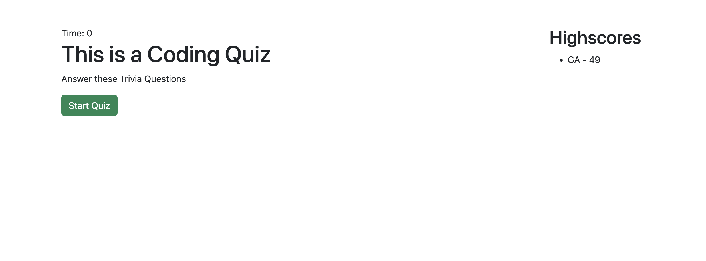

# Coding Quiz

## Description
Coding quiz is a short and quick quiz that allows you to test your CSSand Java knowledge.  Compete against your class or coworkers.

## Screenshots

# Description
Coding quiz is a short and quick quiz that allows you to test your CSSand Java knowledge.  Compete against your class or coworkers.

## Table of Contents
- [Installation](#installation)
- [Usage](#usage)
- [Licesnse](#license)
- [Contributing](#contributing)

- [Questions](#questions)

## Installation
Dowload files and to run in terminal type in "node index.js

## Usage
You can edit questions to what you want and set uit up for co workers to use. You can use thius to challenge friends or classmates.

## License
- MPL_2.0
- Link: https://opensource.org/license/mpl-2-0/   

  

## Contributing
I am the contributor.

## Tests

## Questions
- Github username: gadams45
- Email address: gadams8340@gmail.com
      

## Table of Contents
- [Installation](#installation)
- [Usage](#usage)
- [Licesnse](#license)
- [Contributing](#contributing)
- [Tests](#tests)
- [Questions](#questions)

## Installation
Dowload files and to run in terminal type in "node index.js

## Usage
You can edit questions to what you want and set uit up for co workers to use. You can use thius to challenge friends or classmates.

## License
- MPL_2.0
- Link: https://opensource.org/license/mpl-2-0/   

  

## Contributing
I am the contributor.

## Tests

## Questions
- Github username: gadams45
- Email address: gadams8340@gmail.com
      

## Table of Contents
- [Installation](#installation)
- [Usage](#usage)
- [Licesnse](#license)
- [Contributing](#contributing)
- [Tests](#tests)
- [Questions](#questions)

## Installation
Dowload files and to run in terminal type in "node index.js

## Usage
You can edit questions to what you want and set uit up for co workers to use. You can use thius to challenge friends or classmates.

## License
- MPL_2.0
- Link: https://opensource.org/license/mpl-2-0/   

  

## Contributing
I am the contributor.

## Tests

## Questions
- Github username: gadams45
- Email address: gadams8340@gmail.com
      